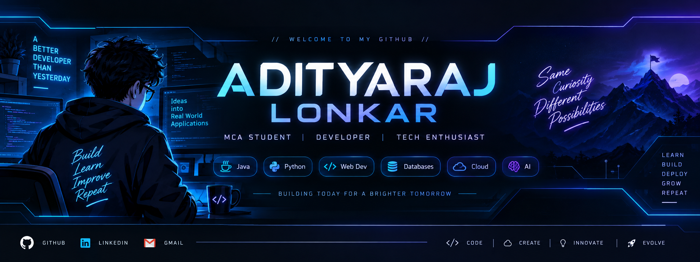

<div align="center">




<br><br>

<!-- Animated Neon Introduction -->

<a href="https://github.com/adityalonkar01">
  
</a>

<br>
<!--# 👋 Hey, I'm ADI-->

### 💻 Developer | 🎓 MCA Student | 🚀 Tech Enthusiast

<p>
  <a href="https://github.com/YOUR_USERNAME">
    
  </a>
  <a href="YOUR_LINKEDIN_URL">
    
  </a>
  <a href="mailto:YOUR_EMAIL">
    
  </a>
</p>

</div>

---

## 👨‍💻 About Me

Hi! I'm **ADI**, a technology enthusiast who enjoys building
web applications, learning new technologies and turning ideas
into working projects.

- 🎓 MCA Student
- 💻 Interested in Software Development
- 🌐 Web Development
- ☕ Java
- 🐍 Python
- 🗄️ Database Development
- 🤖 AI & Prompt Engineering
- 🚀 Always learning and building

---

## 🛠️ Tech Stack

### Programming Languages

<p>


</p>

### Web Development

<p>


</p>

### Database & Tools

<p>


</p>

---

## 🚀 Featured Projects

### 💎 Shree Jewellers

Jewellery e-commerce website with dynamic gold and silver
pricing, product management and checkout functionality.

**Tech:** PHP • MySQL • HTML • CSS • JavaScript

🔗 [View Project](YOUR_REPOSITORY_URL)

---

### 🏆 ZEN Hackathon Platform

A hackathon registration and management platform with
team registration and database integration.

**Tech:** PHP • MySQL • HTML • CSS • JavaScript

🔗 [View Project](YOUR_REPOSITORY_URL)

---

### 🔎 Company Discovery Engine

A platform designed to discover and explore companies using
multiple data sources.

**Tech:** Next.js • Node.js • Express • PostgreSQL • MongoDB

🔗 [View Project](YOUR_REPOSITORY_URL)

---

## 📊 GitHub Stats

<div align="center">


</div>

---

## 📈 Most Used Languages

<div align="center">


</div>

---

## 🎯 Currently Learning

```text
Java
Python
Web Development
Android Development
AI Tools
Prompt Engineering
Data Structures & Algorithms

